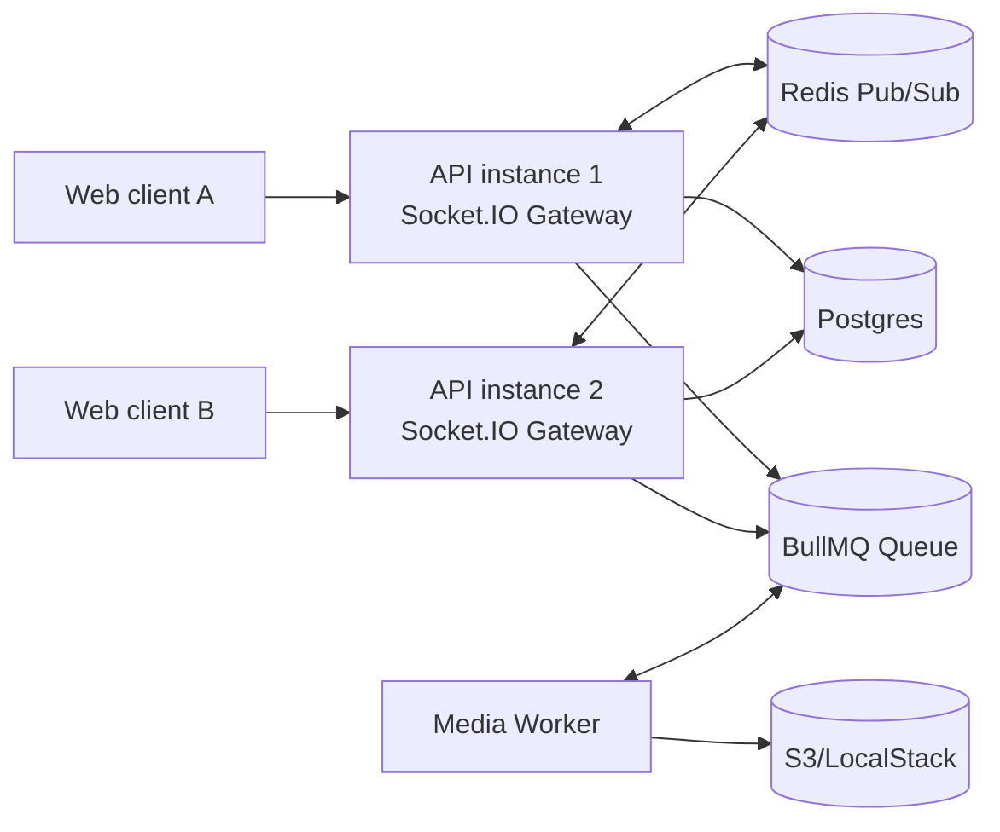

# MyCirvia Monorepo

## Prerequisites
- Node.js 20+
- pnpm
- Docker (for local infra)

## Boot local infrastructure
```bash
docker compose -f infra/docker-compose.yml up -d
```

## Install dependencies
```bash
pnpm -w install
```

## Run apps
```bash
pnpm --filter api dev
pnpm --filter web dev
pnpm --filter worker dev
```

## Horizontal scaling architecture (WebSocket + Redis)



The API now uses `@socket.io/redis-adapter` so Socket.IO rooms and broadcasts are synchronized across multiple API instances.

## Redis and runtime configuration
Set these environment variables for API and worker:

- `REDIS_HOST` (default: `localhost`)
- `REDIS_PORT` (default: `6379`)
- `REDIS_URL` (optional override; derived from host/port when omitted)
- `PORT` (API listen port)
- `WORKER_HEALTH_PORT` (worker health HTTP port, default `3100`)

## Run multiple API instances + standalone worker (local)
Terminal 1:
```bash
pnpm --filter api dev
```

Terminal 2:
```bash
pnpm --filter api dev -- --port 3001
```

Terminal 3:
```bash
pnpm --filter api worker:dev
```

Worker health endpoint:
```bash
curl http://localhost:3100/workers/health
```

## Docker Compose scaling profile (optional)
Start infra + two API instances + worker:
```bash
docker compose -f infra/docker-compose.yml --profile scale up -d
```

Services exposed:
- API #1: `http://localhost:3000`
- API #2: `http://localhost:3001`
- Worker health: `http://localhost:3100/workers/health`

## Production Redis guidance
- Use a managed Redis deployment with persistence + failover.
- Keep low-latency network paths between API instances and Redis.
- Restrict Redis network access to trusted private networks.
- Use TLS and auth/ACLs where your Redis provider supports them.
- Keep `REDIS_URL` consistent across all API and worker instances in the same environment.

## Media worker
```bash
pnpm --filter api worker:dev
```

Required API environment variables for media upload pipeline:
- `AWS_S3_BUCKET`
- `AWS_REGION`
- `AWS_ACCESS_KEY`
- `AWS_SECRET_KEY`

## Troubleshooting
- **Docker services not starting:** Ensure Docker Desktop/Engine is running and ports 5432/6379/4566 are free.
- **Database connection errors:** Verify `apps/api/.env.local` matches `infra/docker-compose.yml` connection details.
- **pnpm install failures:** Confirm Node.js 20+ and `pnpm --version` succeeds.

## Realtime chat identity events (frontend integration)
When chat identity visibility changes, the API emits websocket room events for authorized chat participants:

- `identity-revealed`
  - payload: `{ event, chatId, revealedBy, newIdentity }`
  - frontend behavior: update identity UI immediately + show reveal toast.
- `identity-revoked`
  - payload: `{ event, chatId, revokedBy, newIdentity, refreshMessages: true }`
  - frontend behavior: update identity UI, show revoke toast, and refresh sender display names across existing messages.
- `identity-changed`
  - payload: `{ event, chatId, changedBy, reason, newIdentity }`
  - emitted on reveal/revoke as a generic identity scope invalidation signal.

Message text remains unchanged; only sender display identity should be re-resolved in UI.
